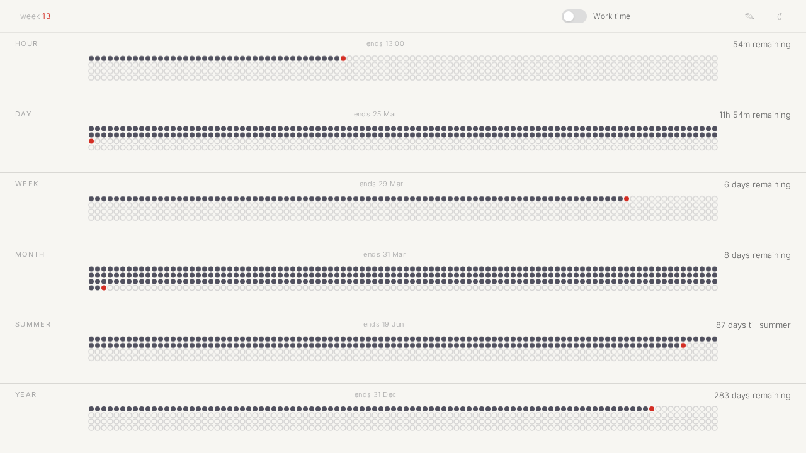

# Aftersummer

A minimal time-progress tracker that shows how far through the day, week, month, year — and summer — you actually are.



## What it does

Each card represents a time period and fills with particles as time passes. No percentages — just contextual labels like "87 days till summer" or "6 days remaining".

| Card   | Tracks                                                      |
|--------|-------------------------------------------------------------|
| Hour   | Current hour (0–59 min)                                     |
| Day    | Current calendar day                                        |
| Week   | Mon–Sun                                                     |
| Month  | Calendar days in current month                              |
| Summer | Jan 1 → Midsommarafton (Swedish midsummer eve)              |
| Fall   | First Monday of August → Dec 31                             |
| Year   | Jan 1 → Dec 31                                              |

**Work time mode** recalculates everything in working hours (08:00–12:00, 13:00–17:00, Mon–Fri, excluding Swedish public holidays). An optional bridge days toggle treats those as non-work days too.

During actual summer (Midsommarafton → first Monday of August) the Summer card turns amber and shows when you're back. The Fall card appears after that.

## Stack

- Vanilla JS (ES modules), no framework, no build step
- Node.js + Express serving static files and proxying the [dagsmart.se](https://api.dagsmart.se) holiday API

## Running

```sh
npm install
npm start
```

Then open http://localhost:3000.

## Docker

```sh
docker compose up
```
